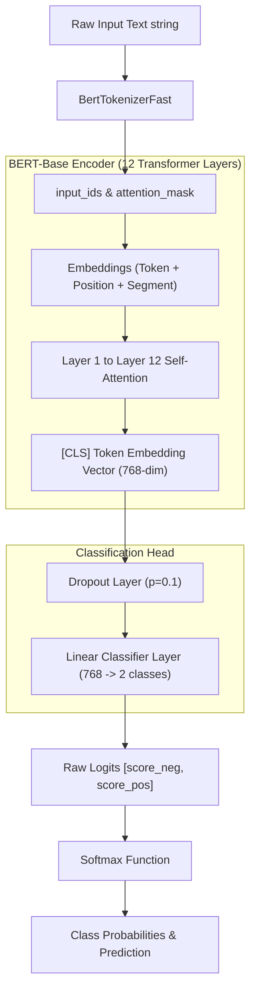
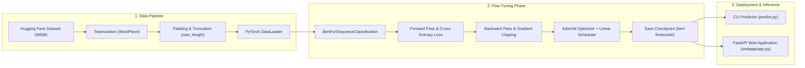

# 🚀 Fine-Tuning BERT for Text Classification

An end-to-end, beginner-friendly pipeline to fine-tune `bert-base-uncased` for text classification (sentiment analysis on movie reviews using the IMDB dataset), complete with command-line inference scripts and an interactive FastAPI web application.

---

## 📌 Table of Contents

1. [Understanding the Concepts](#-understanding-the-concepts)
   - [What is BERT?](#what-is-bert)
   - [What is Fine-Tuning?](#what-is-fine-tuning)
   - [How Tokenization Works](#how-tokenization-works)
2. [System Architecture & Workflow](#-system-architecture--workflow)
   - [Model Architecture Diagram](#model-architecture-diagram)
   - [End-to-End Workflow Diagram](#end-to-end-workflow-diagram)
3. [Project Directory Structure](#-project-directory-structure)
4. [Setup & Installation](#-setup--installation)
   - [GPU / CUDA Setup for Windows](#gpu--cuda-setup-for-windows)
5. [How to Run the Project](#-how-to-run-the-project)
   - [1. Fine-Tuning the Model](#1-fine-tuning-the-model)
   - [2. Predicting via Command Line](#2-predicting-via-command-line)
   - [3. Running the Web Application](#3-running-the-web-application)
6. [Detailed Code & Execution Flow](#-detailed-code--execution-flow)
7. [Hardware & Troubleshooting](#-hardware--troubleshooting)

---

## 🧠 Understanding the Concepts

### What is BERT?
**BERT** (**B**idirectional **E**ncoder **R**epresentations from **T**ransformers) is a state-of-the-art Deep Learning model developed by Google. Unlike traditional text models that read text sequentially (left-to-right or right-to-left), BERT reads the entire sequence of words at once (bidirectionally). This allows it to understand the full context of a word based on both its left and right surroundings.

Pre-trained on billions of words from Wikipedia and BookCorpus, BERT has learned grammar, vocabulary, sentence structure, and general language semantics.

### What is Fine-Tuning?
Training a massive language model from scratch requires millions of sentences and days on specialized hardware. 

**Fine-Tuning** is a transfer learning technique where we take a pre-trained model (`bert-base-uncased`) and attach a small classification layer on top. We then train the model on our specific dataset (e.g., IMDB Sentiment Analysis: *Positive* vs. *Negative*) using a small learning rate. This adapts BERT's existing knowledge to our specific task quickly and accurately.

### How Tokenization Works
Computers cannot directly process raw text string characters. Text must be converted into numerical representation:

1. **Subword Tokenization (WordPiece)**: Text is split into words or subwords. Unseen or complex words are broken down into root components (e.g., `"unbelievable"` $\rightarrow$ `"un"`, `"##believ"`, `"##able"`).
2. **Special Tokens Added**:
   - `[CLS]` (Classification Token): Added to the beginning of every sequence. The final hidden state of `[CLS]` serves as the summary representation for the entire input sequence.
   - `[SEP]` (Separator Token): Marks the boundary between sentences or end of input.
   - `[PAD]` (Padding Token): Appended to shorter sentences to ensure uniform input length across a batch.
3. **Encoding Outputs**:
   - **`input_ids`**: Numerical IDs assigned to each token.
   - **`attention_mask`**: Binary array (`1` for real tokens, `0` for padding) telling BERT which tokens to pay attention to.

---

## 🏗️ System Architecture & Workflow

### Model Architecture Diagram



### End-to-End Workflow Diagram



---

## 📁 Project Directory Structure

```text
Fine-Tuning-BERT/
├── bert-finetuned/         # Output directory containing saved fine-tuned model & tokenizer
│   ├── config.json         # Model configuration parameters
│   ├── model.safetensors   # Trained weights
│   ├── tokenizer.json      # Fast tokenizer vocabulary & config
│   └── vocab.txt           # Subword vocabulary list
├── webapp/                 # Interactive Web Application
│   ├── app.py              # FastAPI + Uvicorn backend server for serving predictions
│   ├── static/             # Frontend assets
│   │   ├── script.js       # Asynchronous API fetch call logic
│   │   └── style.css       # Dark mode CSS stylesheet
│   └── templates/          # HTML view template
│       └── index.html      # UI page layout
├── .gitignore              # Git ignore file (excludes virtual environments & checkpoints)
├── finetune_bert.py        # Main training script (Dataset loading, tokenization, training loop)
├── predict.py              # Command-line inference script for single-text evaluation
├── requirements.txt        # Python package dependencies
└── README.md               # Project documentation
```

---

## ⚙️ Setup & Installation

### Prerequisites
- Python 3.9 – 3.12 (PyTorch CUDA support is tailored for these versions).

### Installation Steps

1. **Clone the repository:**
   ```bash
   git clone https://github.com/Neelesh2133/Fine-Tuning-BERT.git
   cd Fine-Tuning-BERT
   ```

2. **Create and activate a virtual environment:**
   - **Windows:**
     ```bash
     py -3.12 -m venv .venv312
     .venv312\Scripts\activate
     ```
   - **Linux / macOS:**
     ```bash
     python3 -m venv venv
     source venv/bin/activate
     ```

3. **Install dependencies:**
   ```bash
   pip install -r requirements.txt
   ```

---

### GPU / CUDA Setup for Windows

If `torch.cuda.is_available()` returns `False`, your environment may have installed the CPU-only PyTorch build by default.

1. **Check CUDA compatibility:**
   ```bash
   nvidia-smi
   ```
2. **Install CUDA-enabled PyTorch build** (Example for CUDA 12.4):
   ```bash
   pip uninstall torch torchvision torchaudio -y
   pip install torch --index-url https://download.pytorch.org/whl/cu124
   ```
3. **Verify CUDA availability:**
   ```bash
   python -c "import torch; print(torch.__version__); print(torch.cuda.is_available())"
   ```
   *Expected output:* Version ending in `+cu1xx` and `True`.

---

## 🚀 How to Run the Project

### 1. Fine-Tuning the Model

Run the training pipeline using `finetune_bert.py`.

* **Full Fine-Tuning (Default settings):**
  ```bash
  python finetune_bert.py --epochs 3 --batch_size 16 --lr 2e-5
  ```

* **Quick Smoke Test (Small subset for testing/low hardware):**
  ```bash
  python finetune_bert.py --train_subset 200 --eval_subset 100 --epochs 1 --batch_size 2 --max_length 96
  ```

#### Key Arguments:
| Parameter | Default | Description |
| :--- | :--- | :--- |
| `--model_name` | `bert-base-uncased` | Pretrained checkpoint from Hugging Face Hub |
| `--dataset` | `imdb` | Hugging Face dataset name (expects `text` and `label` fields) |
| `--epochs` | `3` | Number of complete passes over the training dataset |
| `--batch_size` | `16` | Number of samples processed before updating weights |
| `--lr` | `2e-5` | Learning rate for AdamW optimizer (recommended: 2e-5 to 5e-5) |
| `--max_length` | `256` | Maximum token sequence length |
| `--output_dir` | `./bert-finetuned` | Output folder to save fine-tuned model weights and tokenizer |

---

### 2. Predicting via Command Line

Run single-sentence inference with your fine-tuned model:

```bash
python predict.py --model_dir ./bert-finetuned --text "This movie was surprisingly great!"
```

**Sample Output:**
```text
Input text: This movie was surprisingly great!
Predicted label: 1
Class probabilities: [0.0312, 0.9688]
```

---

### 3. Running the Web Application

Launch the interactive FastAPI web application (powered by Uvicorn) to analyze sentiment via browser UI:

1. **Navigate to the webapp directory and start server:**
   ```bash
   cd webapp
   python app.py --model_dir ../bert-finetuned --labels negative,positive
   ```
2. **Open browser:**
   Navigate to `http://127.0.0.1:5000` or `http://localhost:5000`.
   *(Interactive Swagger API docs available at `http://127.0.0.1:5000/docs`)*

---

## 🔬 Detailed Code & Execution Flow

### 1. Data Pipeline (`finetune_bert.py`)
- **Dataset Loading**: `load_dataset("imdb")` retrieves train/test splits.
- **Tokenization**: `tokenize_dataset()` processes text using `BertTokenizerFast`.
- **Formatting**: Converts dataset columns into PyTorch tensors (`input_ids`, `attention_mask`, `labels`).

### 2. Model & Optimization (`finetune_bert.py`)
- **Model**: `BertForSequenceClassification.from_pretrained()` loads pretrained weights and appends a classification head.
- **Optimizer**: `AdamW` with weight decay (`0.01`).
- **Scheduler**: Linear learning rate schedule with warmup (`warmup_ratio=0.06`).
- **Gradient Clipping**: `torch.nn.utils.clip_grad_norm_` limits max norm to `1.0` to avoid exploding gradients.

### 3. Model Saving & Artifacts
When training finishes, `save_pretrained()` writes:
- `model.safetensors`: Model state dictionary.
- `config.json`: Architecture hyperparameters.
- `tokenizer.json` & `vocab.txt`: Vocabulary mapping.

---

## 💻 Hardware & Troubleshooting

- **Low VRAM (GPU < 4GB)**:
  Lower `--batch_size` (e.g. `2` or `4`) and `--max_length` (e.g. `96` or `128`) to prevent `CUDA out of memory` errors.
- **Windows Cleanup Warning**:
  ```text
  Exception ignored in: <function ResourceTracker.__del__...>
  AttributeError: '_thread.RLock' object has no attribute '_recursion_count'
  ```
  This is a known Windows Python multiprocessing cleanup issue occurring *after* model saving. It is harmless and can be safely ignored.

---
